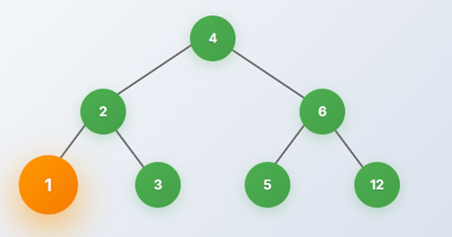
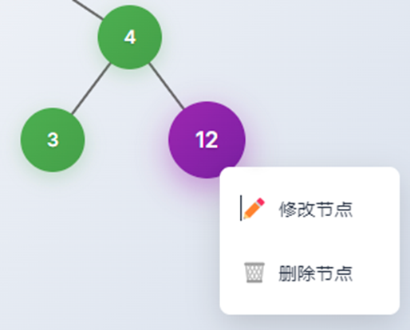
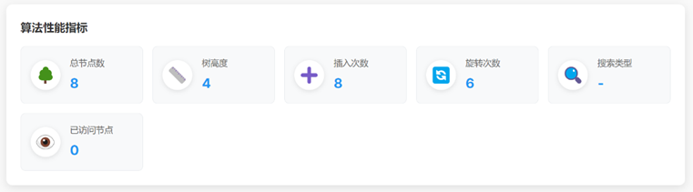
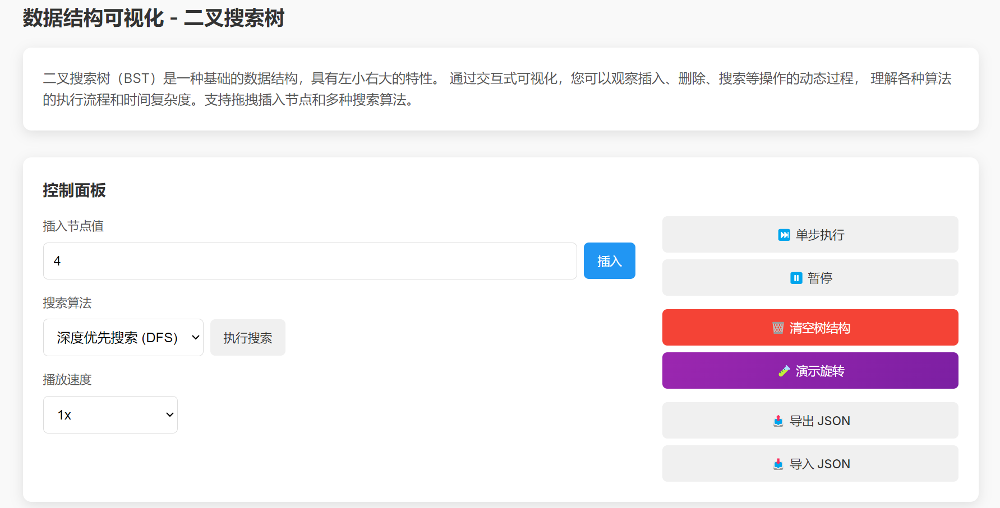
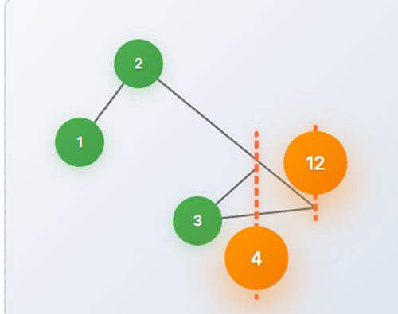

# 高级web技术课程项目文档
> - **第8小组**  王驭风 古凌风 郭光灿 董子禛
---

## 1. 项目概述

本平台通过交互式可视化技术，将抽象操作转化为动态图形：例如，演示链表节点的断开与重连、红黑树的旋转平衡、Dijkstra算法的路径更新等过程。学习者可通过拖拽、参数配置和单步调试，观察每一步操作对数据结构和性能指标的影响，同时实时验证算法正确性并分析复杂度。这种“所见即所得”的学习模式，不仅降低了理解门槛，还通过实践强化理论认知，帮助学习者建立从逻辑设计到工程实现的完整思维框架。该平台对计算机教育具有重要意义，为算法教学提供了沉浸式的实验环境，助力培养问题分析与高效求解的核心能力。

---

## 2. 系统设计文档

### 2.1 系统架构图（前端 Angular + 后端 Spring Boot）

```

```

### 2.2 技术选型

* 前端：
* 后端：
* 部署：
* 特色技术：

### 2.3 模块划分


---

## 3. 功能实现

### 3.1 核心数据结构和算法参数配置可视化建模（30分） 
#### 3.1.1 支持核心数据结构：
比如线性结构：数组（动态数组）、链表（单/双向）、栈/队列；

非线性结构：
- 平衡二叉树
在tree模块中实现，支持左旋右旋，数据组成单元是treenode，树指标输出在metric-display，树结构可视化在tree-visualizer


- 图（邻接表/矩阵）

- 哈希表（链地址法）

#### 3.1.2 支持交互建模
- 拖拽节点生成结构（如拖拽生成树节点）
在树结构模块中，拖拽建树通过HTML原生dragstart + drop事件配合prompt()输入，实现用户交互式节点创建。节点在放置区域生成后立即触发插入逻辑，并在检测到旋转操作时自动生成旋转轨迹动画。


- 右键菜单操作（插入/删除/修改节点）
在树结构模块中，右键菜单基于contextmenu事件显示自定义菜单，允许用户对特定节点执行插入（替换值）、删除与修改操作，所有修改均调用TreeService保持数据同步，并通过refreshLayout()与clearBezier()刷新画布与清空轨迹，避免残留视觉干扰。


- 支持JSON导入导出数据结构配置。
在树结构模块中，导出功能通过将this.root结构序列化为JSON字符串，并创建Blob链接，生成可下载文件。该功能便于保存学习者当前建树状态，或在教学场景中布置标准测试用例。
导入功能通过文件选择触发FileReader读取本地JSON文件，解析为TreeNode结构后更新TreeService中的root，紧接着调用refreshLayout()重新计算节点布局、调用clearBezier()清除上一次动画轨迹，并重置操作记录，保证画布状态与数据同步。


#### 3.1.3  具有算法参数配置功能
>（1）排序类：冒泡/快速/归并（支持可视化比较过程）

>（2）搜索类：BFS/DFS（显示访问路径）

可以设置搜索算法类型，算法播放速度，访问到的节点会高亮


>（3）图算法：Dijkstra/Prim/Kruskal（动态显示权值更新）

>（4）支持随机生成输入数值或者手动通过画布点击创建图节点绘制

### 3.2 交互式仿真控制（20分） 

>• 单步执行：高亮显示当前操作元素
 • 连续模式：速度可调（0.5x-4x）带暂停、继续演示动画等功能 
 • 回溯控制：支持回退到历史步骤 
 • 展示相关的关键指标 
>

- 

- 在树结构中实现了单步执行、0.5x-4x播放速度、暂停、展示指标（见3.1.3）


- 

- 


### 3.3 学习引导系统（30分） 

#### 3.3.1 动态教学（15分）
• 结构演化动画：

> 比如对于链表插入：断开链接→创建节点→重连指针（箭头动画）

> 对于树旋转：节点移动轨迹可视化（贝塞尔曲线运动）

插入节点触发旋转动画，红色虚线表示旋转轨迹。AVL树中的旋转（如左旋、右旋）会在TreeService.rotateLeft()等方法中记录ROTATE_LEFT类操作，并在TreeVisualizerComponent.playOperations()中识别该操作类型，调用generateBezier()方法生成SVG路径，使用红色虚线显示节点旋转轨迹，增强结构演化的视觉表达力。


• 算法过程分解：

> 比如快速排序：分区过程颜色标记（红=基准值，蓝=已处理）

> Dijkstra算法：最短路径渐进式染色（从起点向外扩散）

#### 3.3.2 评估体系（15分） 
• 提供标准测试集（5个左右场景）： 
比如： 
1. 在空二叉搜索树依次插入[5,3,7,2]后前序遍历结果应为？ 
2. 对数组[8,3,1,6]执行快速排序第一次分区后的状态？ 
• 自动判断对错：比如结构验证：检查树的高度平衡性。 
 
### 3.4 进阶功能（20分） 
1、复杂算法支持，比如： 
• 动态规划：背包问题可视化决策矩阵 
• 回溯算法：八皇后问题棋盘冲突检测 
• 分治算法：大整数乘法递归树可视化 

 2、增强交互 
• VR模式：WebGL实现三维数据结构探索（如旋转观察B+树） 


---

## 4. 部署与使用说明

### 4.1 安装步骤

* 前端：

  ```bash
  
  ```
* 后端：

  ```bash
  
  ```
* 数据库初始化：

  * 

### 4.2 云部署说明

* 
* 
* 

---

## 5. 团队分工与贡献比例

| 姓名  | 学号       | 负责模块                    | 关键任务                       | 贡献比例 |
| --- | -------- | ----------------------- | -------------------------- | ---- |
| 王驭风 | 22302010063 | 线性结构与排序 |数组、链表、栈队列 + 排序三种      | 100% |
| 古凌风 | 22302010033 | 树结构与搜索  | AVL、DFS/BFS、拖拽插入节点、旋转动画演示             | 100%  |
| 郭光灿 | 22302010028 | 图结构与图算法 + 后端及部署   | 图建模 + Dijkstra/Prim/Kruskal | 100%  |
| 董子禛 | 22302010054 | 进阶算法与教学系统  | 背包、八皇后、大整数乘法 + 教学系统  + web3d           | 100%  |

---

