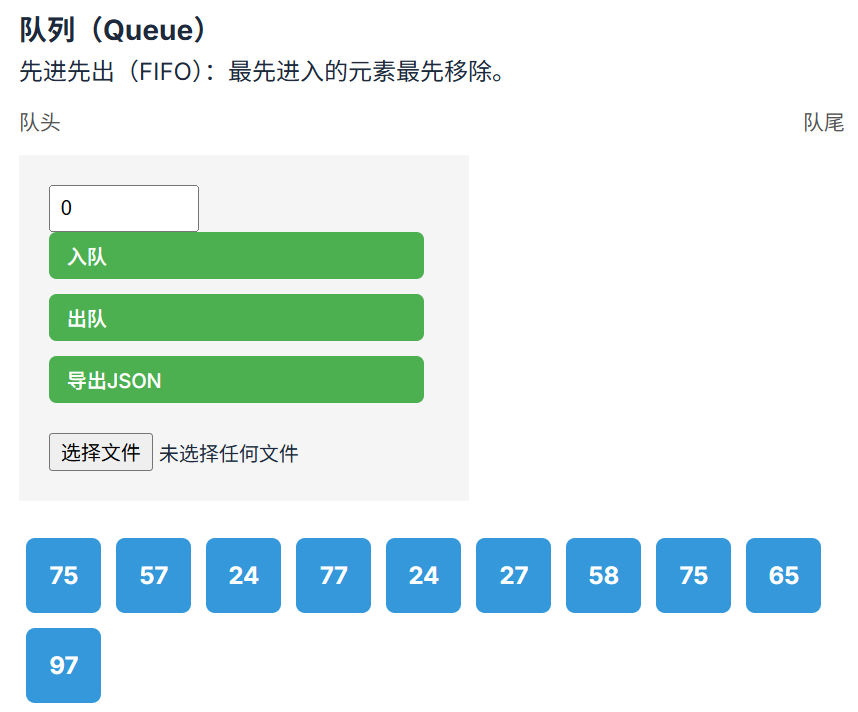
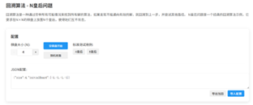
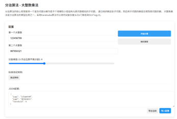

# 高级web技术课程项目文档
> - **第8小组**  王驭风 古凌风 郭光灿 董子禛
---

## 1. 项目概述

本平台通过交互式可视化技术，将抽象操作转化为动态图形：例如，演示不同排序算法的基本逻辑、红黑树的旋转平衡、Dijkstra算法的路径更新等过程。学习者可通过拖拽、参数配置和单步调试，观察每一步操作对数据结构和性能指标的影响，同时实时验证算法正确性并分析复杂度。这种“所见即所得”的学习模式，不仅降低了理解门槛，还通过实践强化理论认知，帮助学习者建立从逻辑设计到工程实现的完整思维框架。该平台对计算机教育具有重要意义，为算法教学提供了沉浸式的实验环境，助力培养问题分析与高效求解的核心能力。

---

## 2. 系统设计文档

### 2.1 系统架构图（前端 Angular + 后端 Spring Boot）


### 2.2 技术选型

* 前端：Angular
* 后端：Spring Boot
* 部署：Docker Compose

### 2.3 模块划分

本课程项目分为线性结构、树结构、图结构、进阶算法四大模块。如下展示的便是网站主页的内容


---

## 3. 功能实现

### 3.1 核心数据结构和算法参数配置可视化建模（30分） 
#### 3.1.1 支持核心数据结构：
比如线性结构：数组、栈、队列；
均在linear模块中实现。支持随机生成、手动插入弹出、导入导出json。

- 数组


- 栈


- 队列


非线性结构：
- 平衡二叉树
在tree模块中实现，支持左旋右旋，数据组成单元是treenode，树指标输出在metric-display，树结构可视化在tree-visualizer


- 图（Dijkstra/Prim/Kruskal算法）
在Graph模块中实现，可对已遍历路径进行染色，以及显示对应权重。

- 哈希表（链地址法）

#### 3.1.2 支持交互建模
- 拖拽节点生成结构（如拖拽生成树节点）
在树结构模块中，拖拽建树通过HTML原生dragstart + drop事件配合prompt()输入，实现用户交互式节点创建。节点在放置区域生成后立即触发插入逻辑，并在检测到旋转操作时自动生成旋转轨迹动画。


- 右键菜单操作（插入/删除/修改节点）
在树结构模块中，右键菜单基于contextmenu事件显示自定义菜单，允许用户对特定节点执行插入（替换值）、删除与修改操作，所有修改均调用TreeService保持数据同步，并通过refreshLayout()与clearBezier()刷新画布与清空轨迹，避免残留视觉干扰。


- 支持JSON导入导出数据结构配置。
在线性结构模块中，支持导入导出json，且各种线性结构的json互通
导出：基于 JSON.stringify() 与浏览器 Blob API，实现数据文件下载；
导入：通过 FileReader 解析本地 JSON 文件，恢复为可操作的 JavaScript 对象。
通过将内存中的数据结构序列化为 JSON 文件，用户可以方便地保存当前数据状态；
同时支持从本地 JSON 文件导入数据，恢复操作环境，实现数据的持久化与灵活管理。
该功能基于浏览器 Blob 和 FileReader API 实现，适用于绝大多数常见线性与非线性数据结构。
示例：图中队列的数据是由数组数据导出的json导入的


在树结构模块中，导出功能通过将this.root结构序列化为JSON字符串，并创建Blob链接，生成可下载文件。该功能便于保存学习者当前建树状态，或在教学场景中布置标准测试用例。
导入功能通过文件选择触发FileReader读取本地JSON文件，解析为TreeNode结构后更新TreeService中的root，紧接着调用refreshLayout()重新计算节点布局、调用clearBezier()清除上一次动画轨迹，并重置操作记录，保证画布状态与数据同步。


#### 3.1.3  具有算法参数配置功能
>（1）排序类：冒泡/快速/归并（支持可视化比较过程）

可以设置排序算法类型，显示算法基本思想与不同类型元素说明，算法播放速度，播放与暂停，上/下步演示，统计算法步数与比较/交换次数。

- **冒泡排序**：
  
  

- **快速排序**：

  

- **归并排序**：

  

>（2）搜索类：BFS/DFS（显示访问路径）

可以设置搜索算法类型，算法播放速度，访问到的节点会高亮


>（3）图算法：Dijkstra/Prim/Kruskal（动态显示权值更新）


>（4）支持随机生成图节点


### 3.2 交互式仿真控制（20分） 

>• 单步执行：高亮显示当前操作元素
 • 连续模式：速度可调（0.5x-4x）带暂停、继续演示动画等功能 
 • 回溯控制：支持回退到历史步骤 
 • 展示相关的关键指标 
>

- 在数组结构中实现了单步执行、0.1-1.0s间隔执行速度、暂停、统计算法步数与比较/交换次数、当前步骤解释、算法基本思想与不同类型元素说明。


- 在树结构中实现了单步执行、0.5x-4x播放速度、暂停、展示指标（见3.1.3）


- 在图算法展示中实现了单步执行时高亮、调整播放速度、暂停、展示指标功能


### 3.3 学习引导系统（30分） 

#### 3.3.1 动态教学（15分）
• 结构演化动画：

> 对于树旋转：节点移动轨迹可视化（贝塞尔曲线运动）

插入节点触发旋转动画，红色虚线表示旋转轨迹。AVL树中的旋转（如左旋、右旋）会在TreeService.rotateLeft()等方法中记录ROTATE_LEFT类操作，并在TreeVisualizerComponent.playOperations()中识别该操作类型，调用generateBezier()方法生成SVG路径，使用红色虚线显示节点旋转轨迹，增强结构演化的视觉表达力。


• 算法过程分解：

> 比如快速排序：分区过程颜色标记

  

> Dijkstra算法：最短路径渐进式染色（从起点向外扩散）


#### 3.3.2 评估体系（15分） 

• 提供标准测试集： 

例1：二叉搜索树提供插入顺序为[10, 5, 1]的旋转示例


例2：大数乘法提供 123456789 * 987654321的例子


• 自动判断对错：

例：N皇后问题在皇后之间互相攻击时可以正确判断


 
### 3.4 进阶功能（20分） 

#### 动态规划：背包问题可视化决策矩阵 

动态规划模块选择经典的 0-1 背包问题作为展示案例，该问题完美体现了动态规划的两个核心特征：最优子结构和重叠子问题。数据模型的设计充分考虑了可视化需求.

动态规划部分的核心是预计算策略。初始化的时候，预计算服务完整执行动态规划的全部。同时在每个决策点需要创建步骤记录，以便于可视化展示时的前进/后退/回溯历史等。

该模块采用了分层协同的组件设计方式。分为以下几个组件。

1.	表格组件。负责动态规划表格的展示。实现了较为丰富的视觉效果，对当前遍历的单元格的变色操作，高亮显示，以及其他动画展示。在算法结束时还呈现最优解情况。核心实现包括动态样式绑定和状态转移动画

2.	配置面板组件：学生可以自定义背包容量，每个物品的名称，重量，价值等，并可以删除和添加物品，也可以随机生成物品。

3.	控制面板组件：实现播放功能，支持0.5倍速到4倍速的变速播放，单步播放，重置，以及可拖动的历史进度条。关键在于还对于每一步给出了步骤解说。


#### 回溯算法：八皇后问题棋盘冲突检测 

回溯算法模块选N皇后问题作为展示案例，该问题的可视化可以部分借鉴动态规划部分，但是也有其独特的一面。需要展示递归的搜索过程、冲突检测的结果、以及回溯的动态过程。数据模型设计需要注重对算法状态变化的精确追踪。同时棋盘状态支持json导入导出，便于使用。

回溯算法的实现严格遵循标准的递归模式，但在每个关键步骤都插入状态记录。冲突检测算法不仅检查约束条件，还详细记录冲突位置，为可视化提供足够的信息。




#### 分治算法：大整数乘法递归树可视化 

分治算法模块选择Karatsuba大整数乘法算法，该算法将时间复杂度从O(n²)优化到 O(n^1.585)。该算法的实现难度远高于前两者，主要原因是需要画出递归树。递归树的可视化是该模块的技术难点，需要解决动态布局、连接线绘制、状态同步等复杂问题。

递归树组件的最大技术挑战是动态连接线的实现。系统使用 SVG 技术动态绘制父子节点间的连接线。递归树的布局采用自适应算法，能够根据树的结构自动调整节点大小和间距，防止树节点之间重叠。




#### VR模式：WebGL实现三维数据结构探索，旋转观察B+树 

B+树的 3D 可视化采用层次化布局策略，将树的不同层级映射到三维空间的y轴上，节点在x轴上按照遍历顺序分布，z轴保持统一以确保视觉的一致性。首先通过递归的方式，遍历收集各层节点，然后为每层节点计算等间距的水平排列位置，层与层之间保持固定的垂直距离。节点的 3D 渲染采用立方体几何体和动态材质系统，根据节点类型（内部节点显示为蓝色，叶子节点显示为绿色）和状态（高亮时显示为黄色）应用不同的视觉效果。关键点在于确保所有键值都能清晰显示。文本标签采用独立的平面几何体，位置略高于节点表面。每个键值对应一个独立的文本标签，在节点内按等间距水平排列。系统支持动态更新文本内容，当节点键值发生变化时自动重新生成纹理。

系统采用独立的控制逻辑确保各操作之间互不干扰。旋转使用鼠标左键拖拽，只改变相机角度，不影响距离；缩放使用鼠标滚轮，只改变距离，保持角度不变；平移使用键盘的wasd操作，直接修改相机位置，保持相对朝向。所有控制操作仅在启用 VR 模式时生效，普通浏览模式下禁用交互控制以避免误操作。

当用户执行搜索操作时，系统首先清除之前的高亮状态，然后将搜索路径上的所有节点标记为高亮状态；重新渲染整个场景以显示静态高亮效果；最后通过分步动画增强视觉冲击力，每个节点按搜索顺序依次触发发光动画。


---

## 4. 部署与使用说明

### 4.1 打包步骤

* 前端：

  ```bash
  ng build
  ```
* 后端：

  ```bash
  mvn clean package
  ```
  

### 4.2 云部署说明

* 将docker/frontend文件夹内的dist替换为构建好的dist
* 将docker/backend/target文件夹内的jar包替换为构建好的jar包
* 运行下方指令即可部署
```bash
docker compose -f 'docker-compose.yml' up -d --build 
```

---

## 5. 团队分工与贡献比例

| 姓名  | 学号       | 负责模块                    | 关键任务                       | 贡献比例 |
| --- | -------- | ----------------------- | -------------------------- | ---- |
| 王驭风 | 22302010063 | 线性结构与排序 |数组、栈、队列可视化 + 三种排序算法 + json导入导出      | 100% |
| 古凌风 | 22302010033 | 树结构与搜索  | AVL、DFS/BFS、拖拽插入节点、旋转动画演示             | 100%  |
| 郭光灿 | 22302010028 | 图结构与图算法 + 后端及部署   | 图建模 + Dijkstra/Prim/Kruskal | 100%  |
| 董子禛 | 22302010054 | 进阶算法与VR模式  | 背包、八皇后、大整数乘法 + web3d           | 100%  |

---

